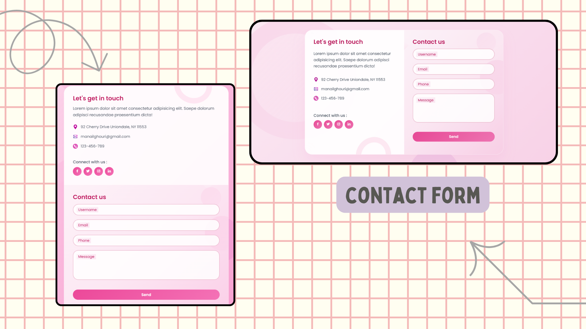

# 🌸 Animated Contact Form

A modern, responsive, and elegant contact form built with HTML, CSS, and JavaScript. This project includes a clean theme with animated floating labels, real-time validation, and beautiful UI transitions using pastel gradients and soft shadows.

---

## ✨ Features

- Fully responsive layout (mobile-friendly)
- Floating labels with animation on focus
- Real-time field validation with error messages
- Smooth form submission simulation with success feedback
- Gradient pastel theme with glassmorphism effect
- Animated background elements (shapes, floating circles)
- Clean and accessible code with semantic HTML
- Social media icon links using [Boxicons](https://cdn.jsdelivr.net/npm/boxicons@latest/css/boxicons.min.css)

---

## 🖥️ Technologies Used

- HTML5
- CSS3 (Custom animations, gradients, responsive design)
- JavaScript (form validation, dynamic UI)
- Google Fonts (`Poppins`)
- Boxicons & Font Awesome for icons

---

## 🚀 Getting Started

1. **Clone the repository**
    ```bash
    git clone https://github.com/Manailghouri/Contact-Form.git
    cd Contact-Form
    ```
2. **Open the project in your browser**
    - Open `index.html` directly, or  
    - Use VS Code Live Server for a better development experience.

---

## 🧪 File Structure
Contact-Form/
├── index.html
├── style.css
├── app.js
├── images/
│ └── screenshot.png
└── README.md


---

## 📸 Preview



---

## 📬 Contact

Made with 💜 by **Manail Ghouri**
